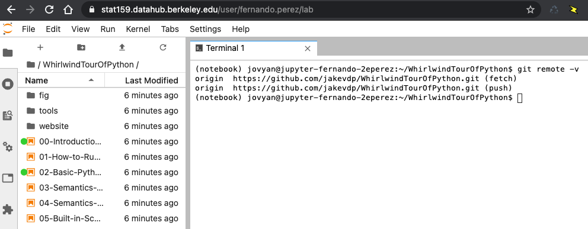

# Statistics 159/259, Homework 1. 

* Due 1/28/2021 11:59PM PT (homework will usually be due Sundays: this is an exception)
* Profs. Perez and Stark, Department of Statistics, UC Berkeley
* This assignment is worth a maximum of 20 points.


For this and all assignments in this course, we will be using a platform known as [Github Classroom](https://classroom.github.com/classrooms/42591242-stat-159-259-spring-2021-university-of-california-berkeley). You will have to manage your submissions as Git repositories that will be hosted here.

For this assignment, you will create a file called `hw01-solution.md` where you will type up your solutions. 
Create the file initially as a copy of this `hw01-background.md` file, and fill in your answer below each question.

You will need to add the file `hw01-solution.md` to your repository and push it back up to Github Classroom so we can see it.


## [2 points] Expectations

Consider a set of ordered pairs, $\{ (x_j, y_j)\}_{j=1}^n$.
Let $\bar{x} \equiv \frac{1}{n} \sum_{j=1}^n x_j$,
$\bar{y} \equiv \frac{1}{n} \sum_{j=1}^n y_j$, and
$\bar{xy} \equiv \frac{1}{n} \sum_{j=1}^n x_j y_j$.
- Is $\bar{xy} = \bar{x}\bar{y}$? If so, sketch a proof; if not, give a counter example.

## [2 points] $P$-values

- In your own words, explain what a $P$-value is (not how to calculate it: what it means).
- Suppose that the $P$-value is 0.04. What does that mean about the null hypothesis?


## [7 points] Hypothesis testing

+ What is the complete null hypothesis for a $Z$-test?

+ Consider testing $N$ null hypotheses at significance level $\alpha$.
Answer the following using closed-form expressions
(not numbers).
    - Suppose all $N$ null hypotheses are true and that the data used to test the 
hypotheses are independent across hypotheses.
        - What is the expected number of null hypotheses that will be rejected erroneously?
        - What is the chance of erroneously rejecting at least one of the null hypotheses?
        - What is the chance of erroneously rejecting at least $k$ of the null hypotheses, $k=1, \ldots, N$?
    - Suppose $T$ of the null hypotheses are true and that the data used to test the hypotheses are independent
across hypotheses.
        - What is the chance of erroneously rejecting at least $k$ of the true null hypotheses, $k=1, \ldots, N-T$?
    - Suppose all $N$ null hypotheses are true but that the data used to test the null hypotheses are not
independent across hypotheses: their dependence is arbitrary.
        - What is the expected number of null hypotheses that will be rejected erroneously?
        - Find a sharp upper bound on the chance of rejecting at least one null hypothesis.

## [4 points] DataHub and Git Practice

Log into the [class DataHub](https://stat159.datahub.berkeley.edu) with your campus credentials. Open a terminal and clone [this github repository that contains a "whirlwind tour" of Python for science](https://github.com/jakevdp/WhirlwindTourOfPython). Note that the same content can be viewed as a regular website [here](https://jakevdp.github.io/WhirlwindTourOfPython/index.html).

You should be reasonably comfortable with most of the material in that overview of Python. Make sure you go through the notebooks, execute their code, make small changes and experiment.

As proof of work, include an image such as the one below in your repo, that shows how in your own hub directory you have the right repository cloned and some of the files in it (this is taken from my account in the Hub):




## [5 points ] Git Practice: collaborating with yourself

- Install Git on your personal laptop (search for and follow the Git installation instructions appropriate to your operating system, be it Windows, MacOS or Linux).
- Clone your homework repository on your personal laptop.
- Create a text file from your laptop named `test.txt` with the following content:

```
Text file created on my personal laptop.
```

- Add it to your repository and push it to Github.

- Pull that file to the DataHub and make further edits to the file from the Hub. Add to the file the output of the command `free` as 
executed on the Hub, as well as the output of the command `pwd`.

- Commit all your changes and push them up to your repo for final submission.
