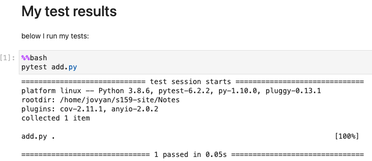

# Homework 3: Coding style, docstrings, algorithmic choices, and unit tests

- **Statistics 159/259, Spring 2021**

- **Due 2/14/2021, 11:59PM PT**

- Profs. Perez and Stark, Department of Statistics, UC Berkeley.

- This assignment is worth a maximum of **30 points**.

## [20 Points] Implement a function three ways and test it.
- This question asks you to write three different Python functions to calculate the chi-square statistic for the "two-sample problem" for categorical data, and write a unit test for those functions. 
    + The functions and tests should be documented well and readable. 
    + The code should have appropriate, useful docstrings and follow PEP-8 and PEP-257. You should run `pycodestyle` and `pep257` on your functions and resolve any errors/warnings.
    + The docstring should explain the approach used in each function, so the reader can understand how they differ.
    + The tests should "exercise" every executable line of your code  

The input is two lists, $x = (x_1, \ldots, x_n)$ and $y = (y_1, \ldots, y_m)$.
Consider the multiset $z = \{z_1, \ldots, z_N\}$ containing the $N = n+m$ (not necessarily distinct) elements of $x$ and $y$.
Let $\{u_k\}_{k=1}^K$ ($K \le N$) denote the unique values in $z$ and let $\pi_k$ denote the relative
frequency of the value $u_k$ among the elements of $z$; that is,
\begin{equation*}
\pi_k \equiv \frac{\#\{ j \in \{1, \ldots, N\}: z_j = u_k \}}{N}.
\end{equation*}

_Hint:_ if you're not familiar with multisets, use the search function in the class site and you will find background material on the concept.

Let $E_k \equiv n \pi_k$ and let $O_k \equiv \#\{ j \in \{1, \ldots, n\} : x_j = u_k \}$;
that is, $O_k$ is the number of elements of $x$ that are equal to $u_k$.
(The symbol $E$ is mnemonic for "expected" and $O$ stands for "observed.")

The chi-square statistic for these data for the two-sample problem is
\begin{equation*}
   \chi^2 = \sum_{k=1}^K \frac{(O_k - E_k)^2}{E_k}.
\end{equation*}

+ [12 points] Write three different Python functions that (each) take as input $x$ and $y$ and return $\chi^2$. The functions should use different strategies and/or different data structures to calculate $\chi^2$. They should all have the same input signature and type of return value. Call them `chisq_1`, `chisq_2` and `chisq_3`. This is a brief outline of what the function skeleton should look like for each of these:

```python

def chisq_1(x, y):
    """
    one-line description.
    
    Further details...
    
    Rest of your docstring
    """
    # Your code goes here...
    
    return your_answer
```
+ [3 points] Compare the speed of your three functions on a variety of inputs of different lengths. Comment on the tradeoff between speed and readability among your three implementations. Hint: use IPython's `%timeit` line magic to get accurate timings of single function calls; type `%timeit?` to find out more information about `%timeit`.

+ [4 points] Write a unit test for the functions to ensure that they work correctly for arbitrary input lists $x$ and $y$.

Your deliverables for this problem will consist of:

+ A Python file, called `chisq.py`, containing the three function implementations plus the necessary tests. Note that your tests need to call *all three functions separately*, so that they can be validated independently.

+ A Jupyter notebook, called `chisq_testing.ipynb`, where you show the output of `pytest`, `pycodestyle` and `pep257`. You can use either cells with individual commands typed as `!command`, or cells that use the `%%bash` cell magic to execute the entire cell as a command-line operation.  This is an illustration of what that can look like with a hypothetical `add.py` file and only showing the call for `pytest`:



The notebook is also where you will run your timings, include the results and discuss them.

## [10 Points] Unit test for the acceptance function for a randomized hypergeometric test

Write a unit test for the function `fisher_accept` in the `tests` notebook (in GitHub: https://github.com/UCB-stat-159-s21/site/blob/main/Notes/tests.ipynb). Your test should check for proper behavior as all input parameters are varied.

- Make a pure python file called `fisher.py` that contains, copied from the `tests.ipynb` Notebook, the implementation of `fisher_accept()` plus any necessary imports. In that file, add your test functions below the implementation of `fisher_accept`. Your code should follow PEP-8 and PEP-257.

- As in the problem before, your deliverables will be both the `fisher.py` file, along with a notebook called `fisher_testing.ipynb`. The notebook will include your runs of the tests. Your test functions (in `fisher.py`) should each have a docstring that explains what condition is being tested.

- If your tests fail and you are convinced that there is an error in the original function, please provide a discussion as well as a second version called `fisher_accept2()` that corrects the problem and passes your tests. Show both the failed and successful tests.
